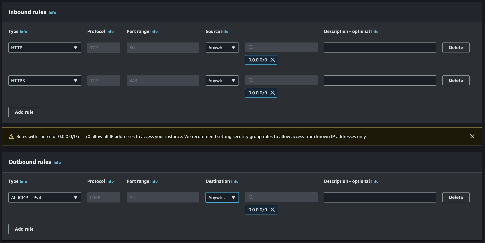
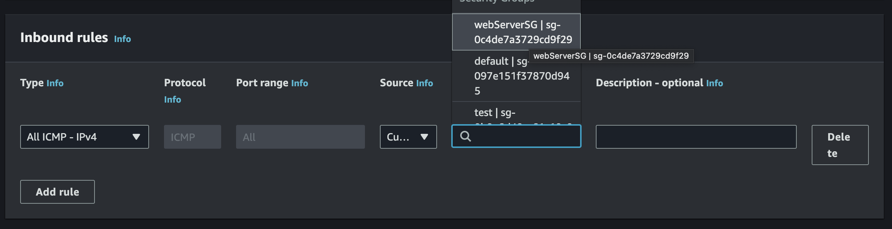
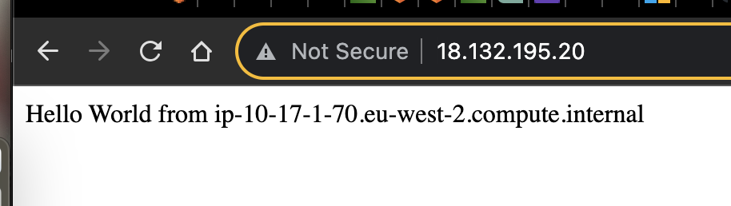
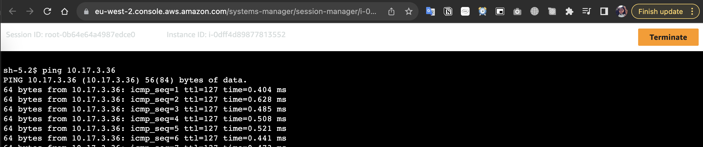

# Lab: Test communication between two subnets in the same AWS region
 ## `CloudFormation` in `London` Region
 Create this tamplete stack 
 ```bash 
 Resources:

  MyVPC:
    Type: AWS::EC2::VPC
    Properties:
      CidrBlock: "10.17.0.0/16"
      EnableDnsSupport: true
      EnableDnsHostnames: true
      Tags:
        - Key: Name
          Value: My-London-VPC

  MyInternetGateway:
    Type: AWS::EC2::InternetGateway
    Properties:    
      Tags:
        - Key: Name
          Value: MyIGW

  AttachGateway:
    Type: AWS::EC2::VPCGatewayAttachment
    Properties:
      VpcId: !Ref MyVPC
      InternetGatewayId: !Ref MyInternetGateway

  PubSubnet1:
    Type: AWS::EC2::Subnet
    Properties:
      VpcId: !Ref MyVPC
      CidrBlock: "10.17.1.0/24"
      AvailabilityZone: eu-west-2a      
      MapPublicIpOnLaunch: true
      Tags:
        - Key: Name
          Value: Lond-PubSubnet-1


  PrivSubnet1:
    Type: AWS::EC2::Subnet
    Properties:
      VpcId: !Ref MyVPC
      CidrBlock: "10.17.3.0/24"
      AvailabilityZone: eu-west-2a
      Tags:      
        - Key: Name      
          Value: Lond-PrivSubnet-1

  PubSubnet2:
    Type: AWS::EC2::Subnet
    Properties:
      VpcId: !Ref MyVPC
      CidrBlock: "10.17.2.0/24"
      AvailabilityZone: eu-west-2b      
      MapPublicIpOnLaunch: true
      Tags:      
        - Key: Name      
          Value: Lond-PubSubnet-2

          
  PrivSubnet2:
    Type: AWS::EC2::Subnet
    Properties:
      VpcId: !Ref MyVPC
      CidrBlock: "10.17.4.0/24"
      AvailabilityZone: eu-west-2b  
      Tags:       
        - Key: Name           
          Value: Lond-PrivSubnet-2


  PublicRouteTable:
    Type: AWS::EC2::RouteTable
    Properties:
      VpcId: !Ref MyVPC
      Tags:
        - Key: Name
          Value: MyPub-Lond-RouteTable      

  PublicRoute:
    Type: AWS::EC2::Route
    DependsOn: AttachGateway
    Properties:
      RouteTableId: !Ref PublicRouteTable
      DestinationCidrBlock: "0.0.0.0/0"
      GatewayId: !Ref MyInternetGateway

  AssociatePubSubnet1:
    Type: AWS::EC2::SubnetRouteTableAssociation
    Properties:
      SubnetId: !Ref PubSubnet1
      RouteTableId: !Ref PublicRouteTable

  AssociatePubSubnet2:
    Type: AWS::EC2::SubnetRouteTableAssociation
    Properties:
      SubnetId: !Ref PubSubnet2
      RouteTableId: !Ref PublicRouteTable
 ```

## VPC and Subnet Configuration
Now you will have a Virtual Private Cloud (VPC) in the `London` region with the following subnets:
- VPC: 10.17.0.0/16
- Public Subnets:
  - Subnet 1 (Lond-PubSubnet-1): 10.17.1.0/24
  - Subnet 2 (Lond-PubSubnet-2): 10.17.2.0/24
- Private Subnets:
  - Subnet 3 (Lond-PrivSubnet-1): 10.17.3.0/24
  - Subnet 4 (Lond-PrivSubnet-2): 10.17.4.0/24

## Step 1: Create Security Groups

1. Create a security group for the public web server named "`webServerSG`" Allow the following `outbound` traffic: `ICMP` anywhere. and allow `inbound` traffic: `HTTP,HTTPS` from anywhere 

2. Create a second security group for testing ping named "`testPingSG`" Allow `inbound` `ICMP` traffic with a custom source. Specify the source as "`webServerSG`" security group  that you created in the previous step.


## Step 2: Launch Instances

### Public Web Server
1. Create an EC2 instance in the public subnet 1 (Lond-PubSubnet-1).
   - Name: `publicWebServer1`
   - OS: Linux
   - AMI: Free tier
   - Instance type: Free tier
   - Key pair: None (Proceed without a key pair)
   - Network settings: VPC (My-London-VPC), Subnet (Lond-PubSubnet-1), Enable Auto-assign public IP
   - Security group: webServerSG
   - Advanced details: IAM instance profile (Select the SSM role you've created), add the Userdata provided by Mohammed
      ```bash
      #!/bin/bash
      yum update -y
      yum install -y httpd
      systemctl start httpd.service
      systemctl enable httpd.service
      echo "Hello World from $(hostname -f)" > /var/www/html/index.html
      ```
   - Launch the instance

2. Test if the instance works by copying the Public IPv4 address and pasting it into a web browser (ensure it's HTTP).


### Private Server
3. Create another instance, but this time make it private. Place it in the private subnet 1 (Lond-PrivSubnet-1).
   - Name: `PrivateServer`
   - OS: Linux
   - AMI: Free tier
   - Instance type: Free tier
   - Key pair: None (Proceed without a key pair)
   - Network settings: VPC (My-London-VPC), Subnet (Lond-PrivSubnet-1)
   - Disable Auto-assign public IP
   - Security group: testPingSG
   - IAM instance profile: Choose the SSM role if you want to see it in Systems Manager
   - Launch the instance

## Step 3: Testing Communication

4. Go to the public instance (`publicWebServer1`) and click "Connect." Use Session Manager to establish a terminal session.

5. In a new browsers window Go to EC2 then instances  access the private instance (PrivateServer). Copy the Private IPv4 address.

6. Return to the terminal session window of publicWebServer1 and type the following command to ping PrivateServer:
   ```bash
   ping <Private IPv4 address of PrivateServer>
   ```
   
